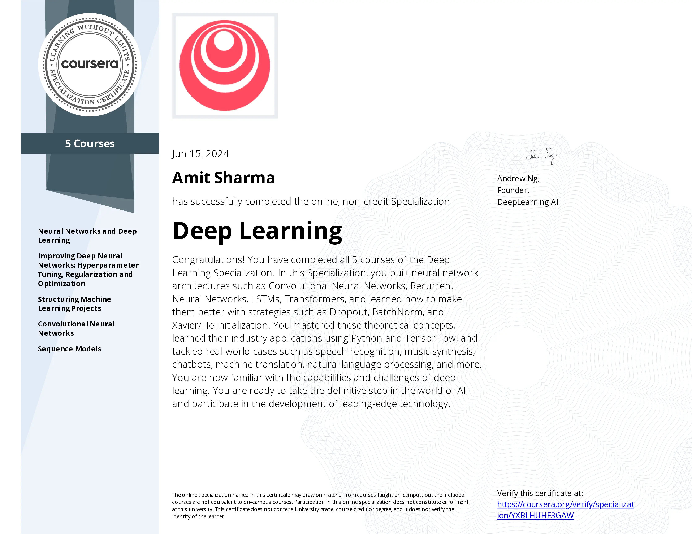
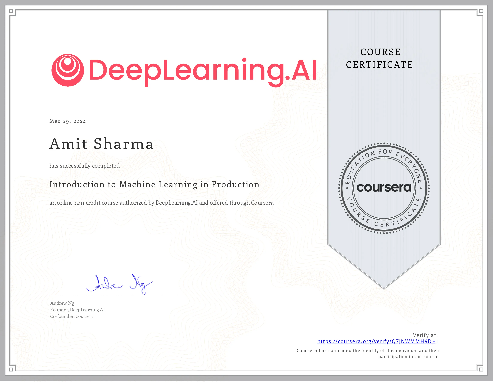
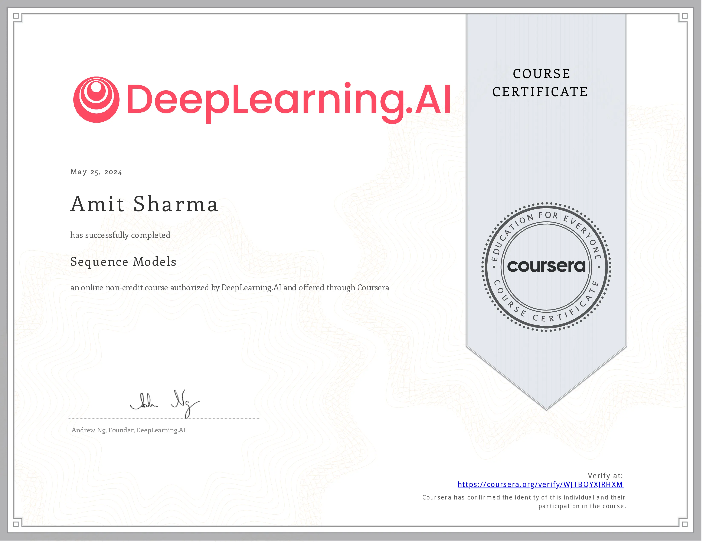
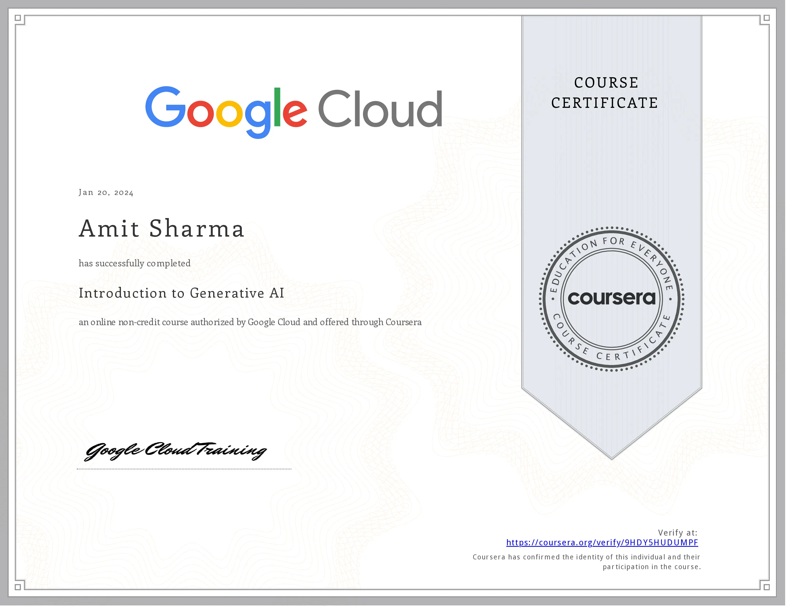
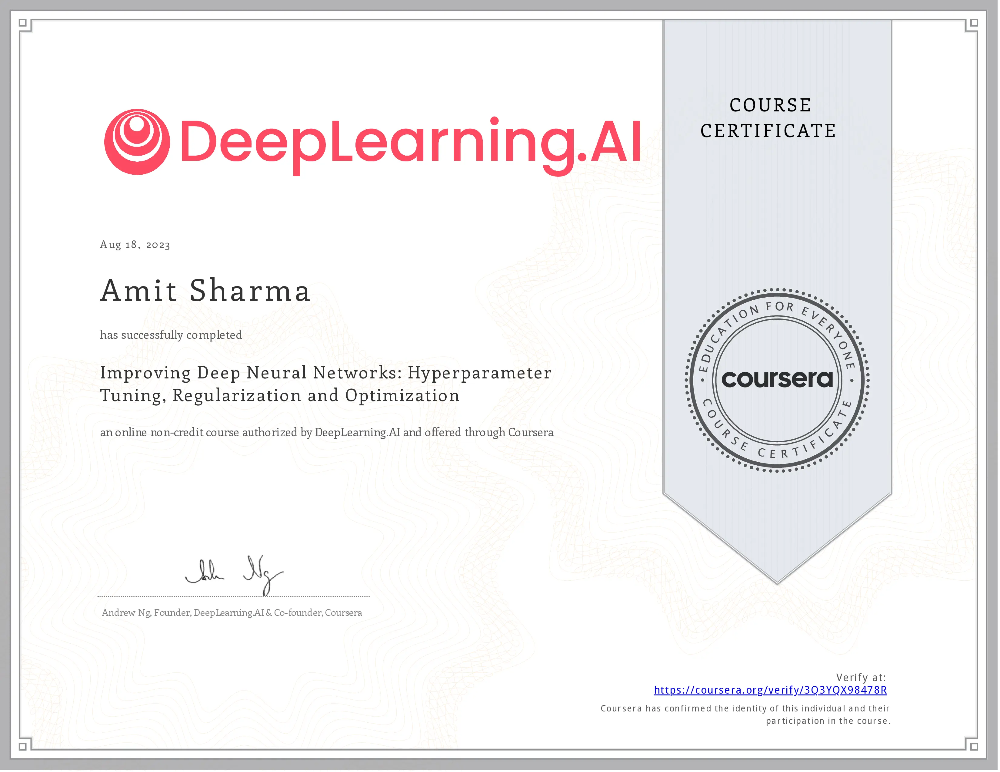
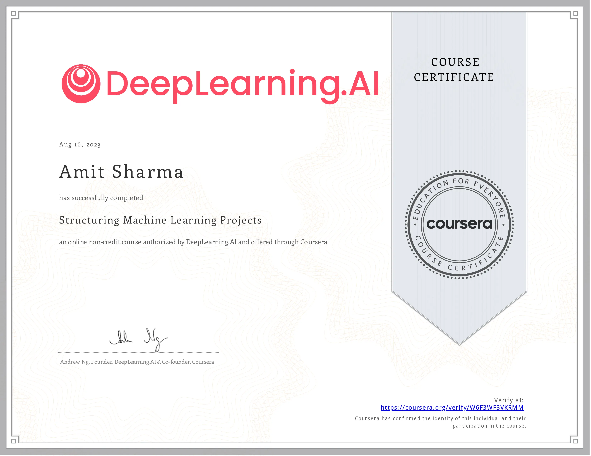
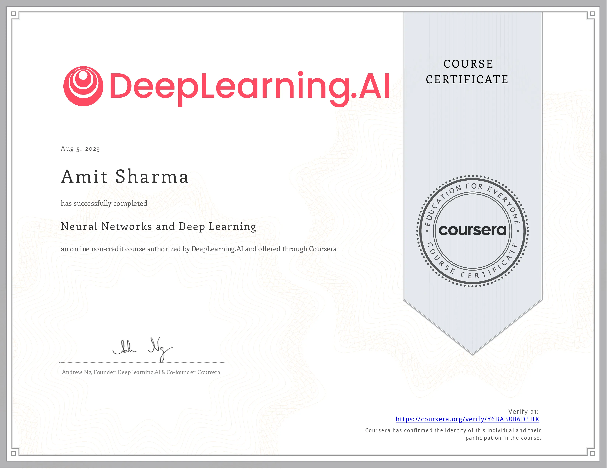

    <h3>Background</h3>
    

        I am a researcher working in the domains of generative AI (GenAI), deep learning, computer vision, and
        IoT systems. I have hands-on experience (5+ years) developing ML algorithms, computer vision techniques,
        customization and transfer-learning of various deep learning models. So far, I have worked on multiple
        sensing modalities including RGB/visible-light cameras, infrared (IR) cameras, magnetic switches, audio
        sensors, RADAR/LiDAR & air-quality sensors.
    

    <!-- Skills Section -->
    <h3>Skills</h3>
    

        Deep Learning
        Machine Learning
        Large Language Models (LLMs)
        Generative AI
        Computer Vision
        AI Agents
        LangChain, LangGraph, LangSmith, CrewAI
        Prompt Engineering
        IoT Systems
        MLOps
        Docker
        Git
        Python
    

    <h3>Education</h3>
    

        <b>PhD in Computer Science (2015 – 2021)</b>  
        SMU, Singapore | Advisor: <a href="https://faculty.smu.edu.sg/profile/archan-misra-376" target="_blank"> Prof
            Archan Misra </a>  
        Dissertation: Vision-based Analytics for Improved AI-driven IoT Applications [<a
            href="https://ink.library.smu.edu.sg/etd_coll/321/" target="_blank"> Link </a>]   
        <b>M.Tech in Mobile & Ubiquitous Computing (2012-2014)</b>  
        IIIT Delhi | Advisor: <a href="https://www.vinayaknaik.info/" target="_blank"> Prof Vinayak Naik </a>
          
        <b>B.Tech in Computer Science (2008-2012)</b>  
        GJ University of Science & Technology, Hisar  
    

    <h3>Professional Certificates</h3>
    

        
        
        
        
        
        
        
        
    

